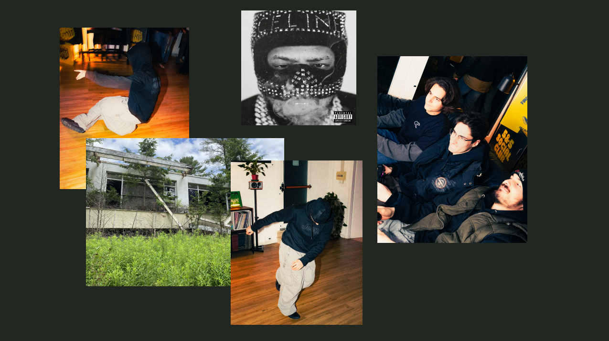

# Introduction
A simple **image viewer** that focuses on cumulative browsing.
Images are queried from a *search bar* and loaded onto an infinite *board*, it can accomodates and infinite amount of images at different scales without compromises on quality.


## Installation
1. Download a *Python 3.14.5 (or higher)* installer from [here](https://www.python.org/downloads/), unless the former isn't already installed on your machine

### Linux
2. Execute the installer with privilege `sudo python -BO install.py`
3. Uninstall the program with privilege `sudo python -BO install.py uninstall`

### Windows
2. Open `Command Prompt` with elevated privilege (right click on application and left click *run as administrator*)
3. Move to the directory with `cd %USERPROFILE%\Desktop\tom-main`
4. Run the installer with `python -BO install.py`

## Usage
1. Run the program with `tom [SAVE].tom` (replace `[SAVE]` with a name of your choice)
2. Press `s` on your keyboard to open the *search bar*
3. Write a path to a valid image file and press `RETURN` on the keyboard to load it onto the *board*
4. Left click an image and drag the mouse, the image will drag as well
5. Left click an image and scroll the mouse wheel, the image will rescale
6. Right click and drag the mouse, the entire canvas will drag as well
7. Scroll the mouse wheel, the canvas will rescale
8. Left click the mouse cursor onto an image and press `x` on the keyboard to delete it


## Troubleshooting
* If *PyGame Community Edition* doesn't install regularly from pip, try following the specifications from [here](https://pypi.org/project/pygame-ce/)


## Trivia
1. This program originated from an idea of mine at the end of July of 2026, I had many exams to take but the excuse to spend time making this was that it was *essential* for organizing my notes.
2. The name *tom* came to mind while thinking of the song title "tower of memories" by ivri.


# Development
The execution starts from `main.py` that applies `tom_serialization.py` to calculate the initial state of `tom_program.py`, a state machine that handles transitions between an *image board* implemented in `tom_board.py` and a *search query* implemented in `tom_search.py`.


## Upcoming features
* Image comments
* World grid
* Physical panning and zooming (momentum, viscousity and elasticity)
* Local and global rotation
* Image cropping
* Image preview while searching

## Issues
* The gaussian blur implementation is approximated with three passes of `pg.transform.box_blur`, its better than `pg.transform.gaussian_blur` but it could be made better.


## Methods

### Levenshtein distance
A method used to compare the similarity between two strings. This is used in the search algorithm to show the best hints possible.

### Lazy scaling
Because most of the time images are scaled outside the scope of the viewport and scaling (smooth-scaling especially) is a costly operation, the idea behind *lazy scaling* is that of cropping out image information outside the viewport's scope before scaling. Without *lazy scaling* zooming very far in creates to much latency. The cost of *lazy scaling* is that *panning* can't be done anymore indipendently of *lazy scaling* a strategy is to make a single pass of *full scaling* before.
```
image.rect_screen = relative_to(image.rect_world, camera)
image.rect.nw = minmax((0, 0), image.rect_screen.nw, (screen.width, screen.height))
image.rect.se = minmax((0, 0), image.rect_screen.se, (screen.width, screen.height))
image.rect_world = absolute_to(image.rect_screen, camera)
scale(crop(image))
```

### Fixed point scaling
Given a change in camera `z`, which `X` should the camera be placed at such that a point `x` remains unchanged (primed variables indicate the transformed counterpart)?
```
(x/z + X) = (x'/z' + X') and x = x'
  => (x/z + X) = (x/z' + X')

X' = x/z - x/z' + X = x(1/z - 1/z') + X
   = x((z'-z)/zz') + X = = x(z'(1-z/z')/zz') + X
   = x((1-z/z')/z) + X

dz := z/z'
X' = x((1-z/z')/z) + X 
  => X += (1-dz)x/z
```
Therefore `(1-dz)x/z` will be the final camera offset that maintains the absolute position `x` constant. This is how I've implemented fixed point zooming.
